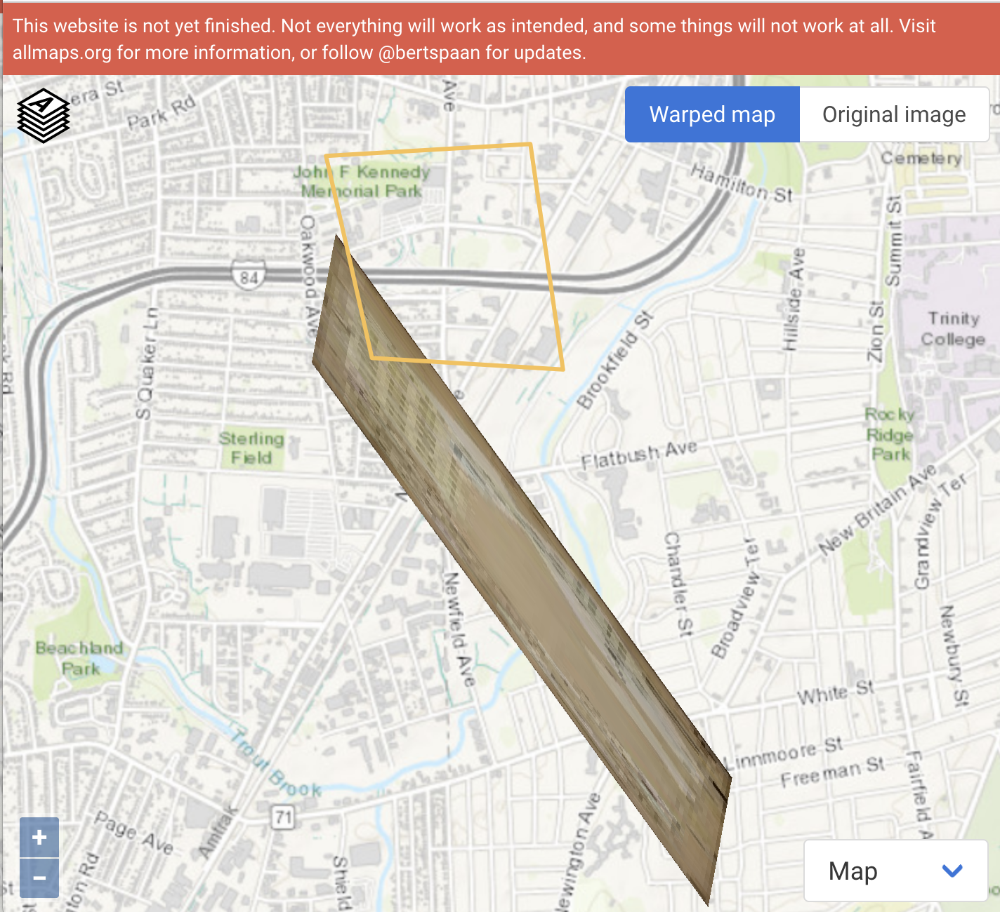
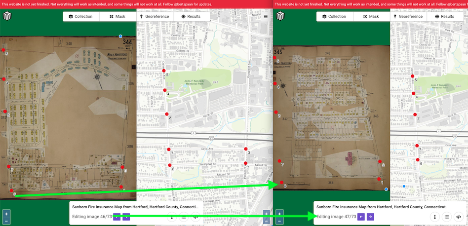

# otl-allmaps-iiif-tests
testing https://AllMaps.org with https://iiif.io map imagery

TODO: explore more with last few slides https://observablehq.com/@bertspaan/allmaps-iiif-annual-conference-2021?collection=@bertspaan/allmaps

Export georeferenced maps to GeoTIFF and map tiles using command-line tools:
`
curl https://annotations.allmaps.org/manifests/FufGYuJRpwqSVuNvi \
  | annotation-to-gdal-script \
  | /usr/bin/env bash
`

OR for hosting tiles, see also

https://khufkens.com/2018/09/19/github-tile-server/
and
https://github.com/nextgis/QTiles
instead of
https://wiki.openstreetmap.org/wiki/User:Ff5722/How_to_create_and_host_tilesets_from_GeoTIFF_images

## Issues
- When testing one image from a multi-page item (Sanborn map book in the Library of Congress), AllMaps created a bad warp for image 46. See illustration further below.
- Also when testing the subsequent page (image 47) from the same multi-page item, AllMaps mistakenly carried over georeferenced points from the prior page (image 46). See illustration of problem further below.

## Feature requests
- Overall, the georeference interface is clean. But I probably would not understand what to do without prior background using related tools, such as https://mapwarper.net. Maybe add a simple tutorial link and/or screencast in the future? For example, I made this [very quick Mapwarper tutorial](https://handsondataviz.org/mapwarper.html).
- Would be nice to add a geocoder search box in the right-hand map to find present-day areas more easily, similar to Mapwarper.
- I accidentally placed markers in wrong places several times while using the current interface, and it was not intuitive for me to remove them. I now see the "list-items hamburger menu" displays marker info and allows users to delete points. Ideas about how to make this feature easier for users to find? Maybe in a future tutorial?
- When I finished adding Georeference points, it was not intuitive how to tell the tool I was done. I eventually clicked the "Georeference" button, but was worried that it would do the opposite by starting over and refreshing the page. Perhaps the future "Results" button will show a preview?
- Also in the future "Result" button, please add a transparency slider to allow us to check our work, similar to Mapwarper.
- In Viewer, what is "Open a IIIF georeference annotation from a URL" supposed to do? It would be ideal to have an easy way to create a short and pretty link to an AllMaps georeferenced map using only its manifest code stored in https://annotation.allmaps.org. But currently we only seem to have this not-so-pretty link: https://viewer.allmaps.org/#type=annotation&data=data:text/x-url,https%3A%2F%2Fannotations.allmaps.org%2Fmanifests%2FufGYuJRpwqSVuNvi

## Successful test of single-page map from Harvard Univ, 2 July 2021

- Harvard item https://curiosity.lib.harvard.edu/scanned-maps/catalog/44-990095630650203941
- Added IIIF manifest link to AllMaps Editor https://iiif.lib.harvard.edu/manifests/ids:5271646
- Georeferenced in the Editor
- In Results tab, clicked on: ...view this map in the Allmaps Viewer
- It worked! See [link to result](https://viewer.allmaps.org/#type=annotation&data=data:text/x-url,https%3A%2F%2Fannotations.allmaps.org%2Fmanifests%2FufGYuJRpwqSVuNvi)

## Unsuccessful test of multi-page Sanborn Map, Library of Congress, late June 2021

- LOC item https://www.loc.gov/item/sanborn01132_011
- Added LOC item IIIF manifest link to Editor https://www.loc.gov/item/sanborn01132_011/manifest.json
- Georeferenced image 46 (of 73) in Editor https://allmaps.org/editor/#/georeference?url=https%3A%2F%2Fwww.loc.gov%2Fitem%2Fsanborn01132_011%2Fmanifest.json&image=5eYuKJgRqEcMRCzG
- Copied annotation from the Editor and pasted into Viewer, but displayed this BADLY WARPED result.

- Also, when moving from image 46 to image 47, the AllMaps editor mistakenly carried over all of my points from the prior page, placing them in the wrong locations. I cannot see a way to delete these points only for image 47, so this appears to be an issue with multi-page map images in IIIF? Or perhaps LOC IIIF ?

